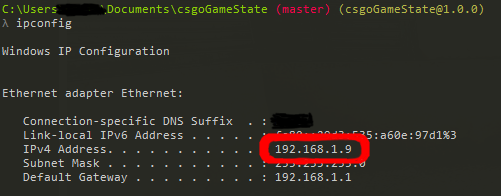
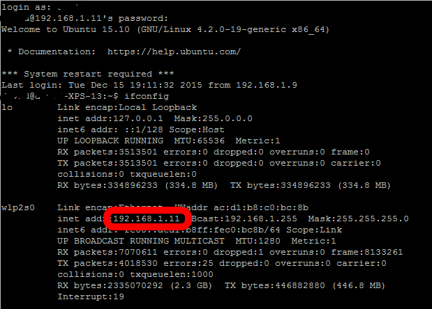
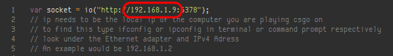
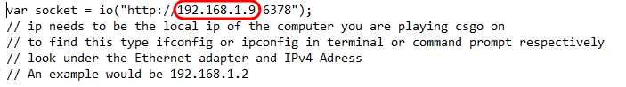

# CSGO Gamestate Webapp

## Areas that need work

* A script to automate installation (copying the nessecary config, putting the correct local ip in client.js)
* A better way to parse weapons
* Some testing on the bomb timer
* Design/CSS and animations
* Installation testing on other platforms

		+----------------+---------+--+
		|    Platform    | Status  |  |
		+----------------+---------+--+
		| W-XP           | Unknown |  |
		| W-Vista        | Unknown |  |
		| W-7            | Unknown |  |
		| W-8.1          | Works   |  |
		| W-10           | Unknown |  |
		| Ubuntu 15.10   | Works   |  |
		| Ubuntu 14.04   | Unknown |  |
		| Debian         | Unknown |  |
		| Fedora         | Unknown |  |
		| Mac El Capitan | Unknown |  |
		| Mac Yosemite   | Unknown |  |
		+----------------+---------+--+

* Mobile testing

# Installing

## Add Config to CSGO

copy

    gamestate_integration_quickstartguide.cfg

into your csgo/cfg folder, locations for various oses below

* **Windows**

    ```C:\Program Files (x86)\Steam\SteamApps\common\Counter-Strike Global Offensive\csgo\cfg```

* **Ubuntu** (*this may not be completely right*)

    ```~/.local/share/Steam/SteamApps/common/Counter-Strike Global Offensive/csgo/cfg```

	For other distros, you probably know what you are doing

* **Mac** (*I've never used a mac so this is just from the internet*)
	
	```/Users/$your_username?/Library/Application Support/Steam/SteamApps/common/Counter-Strike Global Offensive/csgo/cfg```

## Install nodejs

>"Node.js is a JavaScript runtime built on Chrome's V8 JavaScript engine."

Nodejs allows you to run javascript outside the browser, it is what is used to manage the post requests that CSGO makes to send the data.

The program constructs a simple web server, which processes the requests and hands the data off to the rest of the program to be analysed and used in the rest of the program.

**TL:DR you need to install this!**

* **Windows**

	1. Go to <https://nodejs.org/en/>, download the intstaller, and run.

* **Linux**

	1. I would reccommend [installing from your distro's package manager](https://nodejs.org/en/download/package-manager/), this page summs up almost all distros.
	2. You can also build from source.

* **Mac**

	1. Go to <https://nodejs.org/en/>, download the intstaller, and run.

## Configure network specific settings

In order for you to be able to access the information on other computers/phones on your network, you need to point the webpage to the computer you play csgo on (which will be refered to throughout this as the game computer).

This works best if it is a desktop with a wired connection, wifi may be unreliable especially if you have many devices connecting and disconnecting throughout the day. You could also [give the game computer a static ip](http://www.linksys.com/us/support-article?articleNum=140106).

### Step 1
First, you need to find the local IP of the computer you play csgo on

* **Windows**
	1. Get a command prompt by pressing ```Win (Windows Key)``` then typing ```cmd```
	2. type ```ipconfig```, then look for the game computer's local ip
	3. 
* **Linux**
	1. Open a terminal (you should know how to do this)
	2. type ```ifconfig```, then look for the game computer's local ip
	3. 
		
		*Screenshot from Ubuntu*
* **Mac**
	1. Follow the same steps as linux (I don't have a mac so no screenshot)
	2. If you [don't want to use terminal, use this guide](http://osxdaily.com/2010/11/21/find-ip-address-mac/)

### Step 2
Once you have that, you need to edit the ```static/client.js file```. To do this, you need a text editor. Notepad will work just fine (you could also use notepad++, sublime text, or even vim :-)).

* go to line 1
* change the current ip adress (default 192.168.1.9) to the adress you found in the previous step
* *Screenshots from sublime and notepad*
	1. 
	2. 

## Use It!

First, start the server.

* Open a cmd prompt/terminal and navigate to the directory where the program is
* type ```node server.js``` to start the server

now, you can point any browser to <http://localhost:6377> and use it.

If you want to use it from another computer, go to [http://{game-computer's-local-ip}:6377](http://{game-computer's-local-ip}:6377), where the local ip is the same one found under <#Configure-network-specific-settings>.

### Warning

If when you first go to the page, and nothing is there, don't worry, The webapp needs to recieve some data from csgo before it displays anything. You need to switch/start csgo and change weapons or shoot a bit.


## Flags

* ```--log```: Logs data from csgo to ```json.log```